# CipherFX Phase 1 Architecture

This is the rebuilt route. It has one owner per responsibility and passes
immutable contracts between modules.

```mermaid
flowchart LR
    MD[Market Data Engine] --> SNAP[MarketSnapshot]
    SNAP --> LE[Learning Engine]
    LE --> AN[MarketAnalysis]
    AN --> SE[Scoring Engine]
    SE --> SR[ScoreResult]
    AN --> PE[Trade Proposal Engine]
    SR --> PE
    PE --> TP[TradeProposal]
    TP --> EE[Execution Engine]
    EE --> BR[MT5 Gateway / Broker]
    EE --> DB[Database Layer]
    BR --> TM[Trade Management Engine]
    TM --> DB
    DB --> LF[Learning Feedback Engine]
    LF --> DB
```

## Ownership

- **Market Data Engine** reads MT5/bridge data and normalizes candles and ticks.
- **Learning Engine** is the only module that calculates indicators, structure,
  trend, momentum, liquidity facts, and market analysis.
- **Scoring Engine** converts learning facts into one weighted score. It does
  not read candles or broker state.
- **Trade Proposal Engine** turns a passing score into an immutable proposal.
- **Execution Engine** performs broker/risk mechanics only: connection state,
  quote/spread, margin, volume sizing, exposure, duplicate protection, order
  placement, retry boundary, and persistence.
- **Trade Management Engine** reads and manages open positions only.
- **Learning Feedback Engine** consumes closed-trade outcomes only.
- **Database Layer** is the sole persistence boundary for the rebuilt route.

## Authoritative runtime sequence

`MarketSnapshot -> MarketAnalysis -> ScoreResult -> TradeProposal ->
ExecutionResult -> position reconciliation -> closed-trade feedback`

The old `mt5_bot.py`, `scalping_bot_v4.py`, and
`strategies/architecture.py` are not imported by the production runtime.
They are outside the active route. Their retirement/removal is a separate
controlled change after this phase is accepted.
