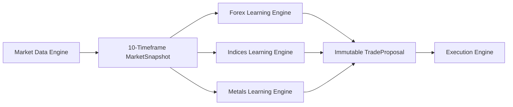

# CipherFX Phase 2 Market Intelligence

The active runtime uses one synchronized snapshot containing:

`MN1 -> W1 -> D1 -> H4 -> H1 -> M30 -> M15 -> M5 -> M3 -> M1`

Each engine owns its own:

- feature extraction
- timeframe weights
- score calculation
- confidence and probability model
- threshold
- adaptive adjustment
- performance-history namespace
- stop and target profile

Forex intelligence evaluates institutional flow, EMA, ATR, ADX, RMI,
liquidity sweeps, sessions, order-block location, FVG, CHOCH, BOS and
continuation.

Indices intelligence evaluates opening drive, gaps, momentum, ADR, range
expansion, retests, session bias, EMA, ATR and ADX.

Metals intelligence evaluates volatility expansion, liquidity grabs, pressure
candles, impulse, mean-reversion zones, order-block location, FVG and momentum.

No engine imports the shared `ScoringEngine`. The execution module receives only
an immutable `TradeProposal`; it does not calculate or rescore market logic.
